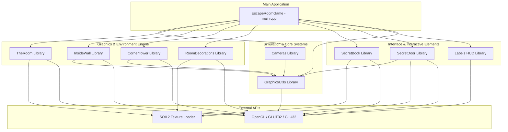

# Escape Room Game 🚪🧩

An immersive, first-person 3D puzzle exploration game built from the ground up in modern C++ and OpenGL. Navigating a mysterious labyrinth of rooms, the player must seek hidden notes, solve environmental logic puzzles, decipher historical and astronomical hints, and unlock security doors via digital PIN pads to escape.

---

## 📖 Table of Contents
1. [🌟 Project Overview](#-project-overview)
2. [🎮 Gameplay Mechanics & User Guide](#-gameplay-mechanics--user-guide)
3. [⌨️ Control Reference Manual](#%EF%B8%8F-control-reference-manual)
4. [🛠️ Technical System Architecture](#%EF%B8%8F-technical-system-architecture)
5. [📦 Modular Sub-Projects & Class Deep-Dive](#-modular-sub-projects--class-deep-dive)
6. [💡 Collision & Grid Mathematics](#-collision--grid-mathematics)
7. [🔦 Lighting, Materials & Rendering Engine](#-lighting-materials--rendering-engine)
8. [🧩 Comprehensive Puzzle Guide & Cheat Sheet](#-comprehensive-puzzle-guide--cheat-sheet)
9. [🏗️ Building, Compiling & Running](#%EF%B8%8F-building-compiling--running)
10. [⚙️ Troubleshooting & Optimizations](#%EF%B8%8F-troubleshooting--optimizations)

---

## 🌟 Project Overview

This game acts as a technical demonstration of interactive 3D graphics, showing how low-level graphic APIs like **OpenGL (via GLUT and GLU)** can be orchestrated with modular software design patterns to produce:
- A dynamic physical camera simulation.
- Real-time keyboard-mouse input handlers.
- Complex procedural object loaders.
- Real-time grid-based collision detection.
- Atmospheric rendering using custom lighting rigs.

The game layout features multiple rooms partitioned by custom interior walls, detailed structural corner towers, and custom decorative items (such as tables, chairs, sofa, desks, lamps, and plants). Progress is gated by 5 major security doors, each requiring a specific numerical passcode derived from surrounding environmental clues.

---

## 🎮 Gameplay Mechanics & User Guide

### 🚶 First-Person Exploration
The player experiences the world through a smooth first-person camera situated at eye-level ($Y = 2.2$ units). The exploration experience mimics modern FPS games:
- **Yaw and Pitch rotation** are controlled dynamically via mouse movement.
- **Linear walking and strafing** are managed via WASD keys, with velocity-based smoothing, acceleration, and damping.
- **Physical simulations** of gravity ($\text{Gravity} = -20.0 \text{ units/s}^2$) and jumping ($\text{Jump Force} = 8.0 \text{ units/s}$) provide a tactile feel when moving around the space.

### 🔍 Interactive Clue System
Interactive items like books or notes are placed on wooden stools throughout the map. When the player approaches an interactive item:
- A contextual action hint (**"Press 'E' to Read"**) fades onto the HUD.
- Pressing **E** triggers an animated opening sequence where the book cover and pages rotate realistically along the spine axis (hinge).
- The detailed note contents are then rendered inside a semi-transparent center-screen HUD dialog.

### 🔐 Passcode Doors
Security doors block access to subsequent corridors and chambers:
- Approaching a locked door displays the prompt **"Press 'E' to Unlock"**.
- Pressing **E** shifts the game state to **PIN Entry Mode**. In this state, normal camera movements and WASD traversal are temporarily frozen.
- Keyboard numbers ($0-9$) are directed to the passcode processor, while the current state is rendered on the screen.
- **Dynamic Input Validation:** Pressing an incorrect digit immediately resets the input buffer, preventing brute-force cracking.
- Upon entering the correct PIN, the double-doors activate their unlocking sequence (swiveling outward on left and right hinges) and permanently clear their collision boxes from the game grid, allowing the player to pass.

---

## ⌨️ Control Reference Manual

The game features dual operation states: **Game Mode** (the default narrative-driven puzzle experience) and **Developer Mode** (a debug/editing layout enabling fly-cams and grid diagnostics).

### 🕹️ Standard Game Controls

| Key / Input | Action | Technical Impact / State Change |
| :--- | :--- | :--- |
| **`W` / `A` / `S` / `D`** | Move Forward / Left / Backward / Right | Computes movement vector relative to camera's forward and right projection. |
| **Mouse Drag / Move** | Look Around (Yaw / Pitch) | Updates rotation matrices; warps pointer back to window center to prevent cursor bleed. |
| **`Spacebar`** | Jump | Applies upward velocity impulse if player is currently resting on the ground level. |
| **`Left Shift`** | Sprint | Smoothly interpolates the camera's current speed multiplier from $1.0\times$ to $2.5\times$. |
| **`E`** | Interact (Read/Unlock/Cancel) | Toggles book animation states, initializes PIN entry mode, or cancels PIN entry. |
| **`F`** | Toggle Flashlight | Enables/disables `GL_LIGHT1` and `GL_LIGHT2` (spotlight and player aura). |
| **`Tab`** | Toggle Help Menu | Renders a 2D orthographic instructions overlay over the top-left section of the screen. |
| **`P`** | Switch to Developer Mode | Toggles camera state, unlocks height restrictions ($Y$), and shows system cursor. |
| **`Esc`** | Exit Game | Deconstructs active buffers, frees allocated pointers, and terminates the application process. |

### 🛠️ Developer Mode Controls

When **Developer Mode** is activated (by pressing **`P`**), the camera changes to a free-fly mode, and the following keys are enabled:

| Key / Input | Action | Technical Impact / State Change |
| :--- | :--- | :--- |
| **`E` / `Q`** | Fly Up / Fly Down | Directly increments or decrements the camera's $Y$ coordinate position. |
| **`Arrows` (Left/Right/Up/Down)** | Look Around (Keyboard fallback) | Increments Yaw and Pitch values programmatically without mouse tracking. |
| **`T`** | Toggle Coordinate Axes | Draws Red ($+X$), Green ($+Y$), and Blue ($+Z$) debug lines from the origin $(0,0,0)$. |
| **`C`** | Toggle Navigation Grid | Renders a grid on the $XZ$ floor plane and labels coordinates on the center of each cell. |

---

## 🛠️ Technical System Architecture

The game utilizes a **modular, statically-linked multi-project library design** orchestrated by a main executable project. This decouples the game engine subsystems (geometry, camera, HUD, utilities, and decorative entities).



---

## 📦 Modular Sub-Projects & Class Deep-Dive

### 1. Main Game Controller ([EscapeRoomGame](EscapeRoomGame/EscapeRoomGame/main.cpp))
- **Role:** Handles the startup process, links the modules together, and directs OS events to their respective controllers.
- **Responsibilities:**
  - Standard glut initialization (`glutInitDisplayMode`, `glutCreateWindow`, window centering math).
  - Registering window callback bindings (`glutDisplayFunc`, `glutKeyboardFunc`, `glutSpecialFunc`, `glutPassiveMotionFunc`, `glutIdleFunc`, `glutReshapeFunc`).
  - Instantiating and cleaning up global pointers (`g_camera`, `g_room`, `g_insideWalls`, `g_tower`, `g_book`, `g_door`, `g_decor`, `g_labels`).
  - Handling real-time PIN code routing and validation logic.

### 2. First-Person Camera Engine ([Cameras](EscapeRoomGame/Cameras/Cameras.h))
- **Role:** Manages coordinates, camera orientation vectors, physical speed parameters, and state changes.
- **Responsibilities:**
  - Translating mouse delta inputs to Yaw and Pitch values.
  - Computing direction vectors:
    $$\vec{F} = \langle \cos(\text{pitch}) \cdot \sin(\text{yaw}), \sin(\text{pitch}), -\cos(\text{pitch}) \cdot \cos(\text{yaw}) \rangle$$
    $$\vec{R} = \langle -\vec{F}_z, 0, \vec{F}_x \rangle$$
  - Implementing physics calculations (jump impulses, gravity pull, speed damping).
  - Performing collision checking against target cells before committing coordinate updates.

### 3. Room Geometry Builder ([TheRoom](EscapeRoomGame/TheRoom/TheRoom.h))
- **Role:** Generates the base layout of the room, including the floor, walls, and ceiling.
- **Responsibilities:**
  - Loading texture maps via SOIL2 and setting up mipmapping parameters.
  - Compiling visual commands into an **OpenGL Display List** (`glGenLists`, `glNewList`, `glEndList`) to cache calculations directly on the GPU.
  - Applying texture wrap settings (`GL_REPEAT`) and surface normals ($\vec{N}$) for lighting models.

### 4. Custom Architecture Elements ([InsideWall](EscapeRoomGame/InsideWall/InsideWall.h) & [CornerTower](EscapeRoomGame/CornerTower/CornerTower.h))
- **Role:** Adds interior walls and structural corner towers to partition rooms and define the game map layout.
- **Responsibilities:**
  - **InsideWall:** Creates wall panels of adjustable thickness and automatically blocks the corresponding coordinates in the collision system.
  - **CornerTower:** Renders detailed architectural pillars with a 3-tier cascading base and capital, adding decorative corner accents while acting as physical barriers.
  - Uses Display Lists for fast, hardware-accelerated rendering.

### 5. Interactive Environment Objects ([SecretBook](EscapeRoomGame/SecretBook/SecretBook.h) & [SecretDoor](EscapeRoomGame/SecretDoor/SecretDoor.h))
- **Role:** Coordinates the visual display, physical barriers, and interaction logic for books and gated doors.
- **Responsibilities:**
  - **SecretBook:** Displays open/closed animations by rotating the top cover and pages over the spine axis (hinge). Includes a detailed wood-textured stool base.
  - **SecretDoor:** Renders double-doors with brass handles and details like a top grill (built using GLU quadric cylinders). Manages smooth swinging animation states and updates the collision grid when unlocked.

### 6. Dynamic HUD Renderer ([Labels](EscapeRoomGame/Labels/Labels.h))
- **Role:** Draws standard 2D overlay graphics, help screens, interactive dialog boxes, and coordinate details.
- **Responsibilities:**
  - Shifting OpenGL matrices from 3D projective coordinates to a 2D Orthographic view (`gluOrtho2D`).
  - Measuring line widths in pixels (`glutBitmapWidth`) to auto-size dark background boxes for readability.
  - Rendering text strings using raster characters (`glutBitmapCharacter`).

### 7. Coordinates & Debug Utilities ([GraphicsUtils](EscapeRoomGame/GraphicsUtils/GraphicsUtils.h))
- **Role:** Coordinates mapping systems, collision arrays, and debug visuals.
- **Responsibilities:**
  - Storing the global collision data array.
  - Converting 3D world coordinates $(X, Z)$ to grid coordinates $(Col, Row)$.
  - Drawing coordinate axes lines and grid boxes with cell coordinate text labels.

---

## 💡 Collision & Grid Mathematics

The collision engine uses a grid-based approach to prevent players from passing through solid objects.

```
+---------------------------------------------------+
|                  COLLISION GRID                   |
|  Size: 40.0 x 40.0 Units                          |
|  Resolution: 40 x 40 Cells                        |
|  Cell Size: 1.0 x 1.0 Unit                        |
|                                                   |
|      (Grid Origin Shifted to Top-Left corner)     |
|                                                   |
|       -20.0f (World Minimum Coordinate)           |
|          |                                        |
|          v                                        |
|      +-------+-------+-------+ ... +-------+      |
|      | (0,0) | (1,0) | (2,0) |     | (39,0)|      |
|      +-------+-------+-------+ ... +-------+      |
|      | (0,1) | (1,1) | (2,1) |     |       |      |
|      +-------+-------+-------+ ... +-------+      |
|      |   :   |   :   |   :   |     |   :   |      |
|      +-------+-------+-------+ ... +-------+      |
|      | (0,39)|       |       |     |(39,39)|      |
|      +-------+-------+-------+ ... +-------+      |
|                                         ^         |
|                                         |         |
|                      +20.0f (World Max) |         |
+---------------------------------------------------+
```

### Coordinate Conversion Formula
The world space is centered at $(0.0, 0.0)$, spanning from $-20.0\text{f}$ to $+20.0\text{f}$ on both the $X$ and $Z$ axes.
To map a world position $(W_x, W_z)$ to the grid cell indices $(G_x, G_z)$, the system shifts the coordinates and divides by the cell width ($1.0$ unit):

$$G_x = \text{floor}\left( \frac{W_x + 20.0}{1.0} \right)$$
$$G_z = \text{floor}\left( \frac{W_z + 20.0}{1.0} \right)$$

If $G_x$ or $G_z$ fall outside the range $[0, 39]$, the position is flagged as blocked.

### Collision Checking Protocol
Before the camera updates its coordinates, it checks the proposed path. To keep the camera from clipping into walls, the system includes a collision padding radius ($0.2\text{f}$):

```cpp
// Check X-Axis Movement
float checkX = m_posX + (m_velX > 0 ? CAMERA_COLLISION_PADDING : -CAMERA_COLLISION_PADDING) + m_velX * dt;
if (isGridPositionBlocked(checkX, m_posZ)) {
    m_velX = 0;           // Cancel X velocity
    potentialNextX = m_posX; // Reset X target
}

// Check Z-Axis Movement
float checkZ = m_posZ + (m_velZ > 0 ? CAMERA_COLLISION_PADDING : -CAMERA_COLLISION_PADDING) + m_velZ * dt;
if (isGridPositionBlocked(potentialNextX, checkZ)) {
    m_velZ = 0;           // Cancel Z velocity
    potentialNextZ = m_posZ; // Reset Z target
}
```

### Dynamic Obstacle Updates (Locked Doors)
When a door is closed, it blocks a $4 \times 1$ horizontal or vertical segment on the grid. This blocked area includes both door posts and the double panels.
When the door is successfully unlocked, the system updates the grid state:
- The outer door post coordinates remain **permanently blocked**.
- The two center cells (corresponding to the swinging door panels) are **unblocked**, allowing the player to pass through.

---

## 🔦 Lighting, Materials & Rendering Engine

The game engine features three lighting configurations that update dynamically based on the game state:

### 1. Flashlight System (`GL_LIGHT1`)
Designed to simulate a forward-facing spotlight. It is positioned slightly behind the player's view vector to prevent harsh clipping against nearby walls:
- **Cut-Off angle:** $70^\circ$ (cone spread).
- **Exponent factor:** $20.0$ (focuses light intensity at the center of the beam).
- **Attenuation constants:** Constant ($0.8$), Linear ($0.02$), Quadratic ($0.0$). This provides a natural, gradual falloff over distance.

### 2. Player Aura Lantern (`GL_LIGHT2`)
An omnidirectional light source centered on the player that casts a warm glow on the immediate surroundings, ensuring visible details even when the flashlight is turned off:
- **Warm Kelvin Tone:** Diffuse and Specular components are set to pale orange/yellow: $\langle R=1.0, G=0.95, B=0.80 \rangle$.
- **Cut-Off angle:** $180^\circ$ (omnidirectional sphere).
- **Attenuation constants:** Constant ($1.0$), Linear ($0.02$), Quadratic ($0.002$) for realistic falloff.

### 3. Developer Mode Ambient Rigs
When switching to developer mode, the dark atmosphere is disabled for easier navigation and editing:
- Ambient light values scale up to a bright setting: $\langle 0.6, 0.6, 0.6 \rangle$.
- The spot beam (`GL_LIGHT1`) remains active, while the player aura (`GL_LIGHT2`) is disabled to prevent color washing.

---

## 🧩 Comprehensive Puzzle Guide & Cheat Sheet

Progression is gated by **5 major passcode doors**. Players must search the rooms to find corresponding clues and hints.

```
       +------------------------------------+
       |             MAP GRID               |
       |                                    |
       |             [Room 4]               |
       |            Bedroom Area            |
       |                 |                  |
       |               [Door 4]             |
       |            (Code: "111")           |
       |                 |                  |
       |  [Room 3] -- [Door 1] -- [Room 2]  |
       |  TV Room   (Code: "1134") Space/Sci|
       |     |                              |
       |   [Door 2]                         |
       | (Code: "1927")                     |
       |     |                              |
       |  [Room 1] -- [Door 3] -- Corridor  |
       |  Starting   (Code: "188")          |
       |  Chamber                           |
       |     |                              |
       |   [Door 0]                         |
       | (Code: "157")                      |
       |     |                              |
       |  [Entrance Lobby]                  |
       +------------------------------------+
```

### 🚪 Door 0 (Passage from Entrance Lobby)
- **Required Code:** `157`
- **Environmental Hints:**
  - *Note #1:* "The first number is the loneliest number." $\rightarrow$ **1**
  - *Note #2:* "Look at your hand. Count the fingers." $\rightarrow$ **5**
  - *Note #3:* "Days in a week. Colors in a rainbow." $\rightarrow$ **7**
  - *Note #4:* "Sometimes I forget the PIN number, so I attached three notes with hints."

### 🚪 Door 1 (Passage to Space/Science Room)
- **Required Code:** `1134`
- **Environmental Hints:**
  - *Note #1:* "Look at the Apollo mission number." $\rightarrow$ Apollo **11**
  - *Note #2:* "How many people are in the rocket?" $\rightarrow$ Apollo 11 crew consisted of **3** astronauts.
  - *Note #3:* "How many inner planets are in our solar system?" $\rightarrow$ Mercury, Venus, Earth, and Mars $\rightarrow$ **4**
  - *Note #4:* "The passcode is a 4-digit number: [Apollo Mission Number][Crew Count][Inner Planet Count]."

### 🚪 Door 2 (Passage to TV Room)
- **Required Code:** `1927`
- **Environmental Hints:**
  - *Note #1:* "The TV room PIN is the year the first fully electronic TV was demonstrated."
  - *Note #2:* "The first fully electronic television system was demonstrated by Philo Taylor Farnsworth in **1927**."

### 🚪 Door 3 (Passage to Side Corridors)
- **Required Code:** `188`
- **Environmental Hints:**
  - *Note #1:* "As I remember, I wrote the PIN number hint in my bedroom diary."

### 🚪 Door 4 (Passage to Bedroom Suite)
- **Required Code:** `111`
- **Environmental Hints:**
  - *Note #1:* "The first two digits: look at the sofa and count something."
  - *Note #2:* "The next digit: how many pillows are in my bedroom?"

---

## 🏗️ Building, Compiling & Running

The project includes all necessary dependencies in the source tree, making it easy to build and run out-of-the-box.

### 📋 Prerequisites & Tools
- **Operating System:** Windows 10 / 11.
- **IDE:** Visual Studio 2022 (with the **Desktop development with C++** workload installed).
- **Platform Architecture Target:** x86 (Win32) configuration.

### 🛠️ Build Steps
1. Navigate to the project root directory and open `EscapeRoomGame.sln` in Visual Studio 2022.
2. In the top toolbar, set the Build Configuration to **`Debug`** or **`Release`** and set the Target Platform to **`x86`** (Win32 is required since the pre-built GLUT dependency binaries are 32-bit).
3. Right-click the main **`EscapeRoomGame`** project in the Solution Explorer and select **Set as Startup Project**.
4. Press **`F5`** (or go to *Debug > Start Debugging*) to compile the static libraries and run the game.

### 📁 Dependency Structure
All compile-time headers and link-time libraries are located in the `Dependencies/` folder:
- **GLUT Header & Lib:** `Dependencies/freeglut/include/GL/glut.h`, `Dependencies/freeglut/lib/freeglut.lib`
- **SOIL2 Header & Lib:** `Dependencies/SOIL2/include/SOIL2.h`, `Dependencies/SOIL2/lib/SOIL2.lib`
- **Runtime DLLs:** `glut32.dll`, `opengl32.dll`, and `glu32.dll` are located in the main project folders. They are copied to the build output folder automatically during compilation to ensure the executable runs correctly.

---

## ⚙️ Troubleshooting & Optimizations

### 🚀 Graphics Optimizations
- **Display Lists:** Static assets (walls, ceiling, floor, corner towers) are pre-compiled into OpenGL display lists. This caches geometry on the GPU, avoiding CPU bottlenecks during render loops.
- **Mipmapping & Texture Filtering:** Textures are loaded using SOIL2 with mipmaps. This improves performance and reduces aliasing on distant surfaces:
  - Minifying filter: `GL_LINEAR_MIPMAP_LINEAR` (trilinear filtering).
  - Magnifying filter: `GL_LINEAR` (bilinear filtering).
- **LOD Bias Adjustment:** An LOD bias constant is applied to sharpen textures at oblique angles:
  ```cpp
  glTexParameterf(GL_TEXTURE_2D, GL_TEXTURE_LOD_BIAS_EXT, -0.5f);
  ```

### 🔍 Common Build Issues & Fixes

#### 1. Linker Error: "LNK2019: unresolved external symbol `__imp__glutInit`..."
- **Cause:** Visual Studio is configured to compile for x64, but the libraries in the project are 32-bit.
- **Solution:** Change the target platform configuration in the top dropdown from `x64` to `x86`.

#### 2. Runtime Error: "The code execution cannot proceed because glut32.dll was not found..."
- **Cause:** The compiler could not locate `glut32.dll` in the working directory of the compiled executable.
- **Solution:** Verify that `glut32.dll` is present in the `EscapeRoomGame/` folder. When running the game from Visual Studio, make sure the project's Working Directory is set to the folder containing the DLL.

#### 3. Compilation Error: "exit() function redefinition..."
- **Cause:** Conflicts between standard headers and the GLUT header.
- **Solution:** Ensure `<stdlib.h>` is included before `<glut.h>` in all source code headers.

---

*Enjoy playing and exploring the Escape Room Game! Use your search skills and logical reasoning to solve the puzzles and escape the room.* 🎮🔐🚪
